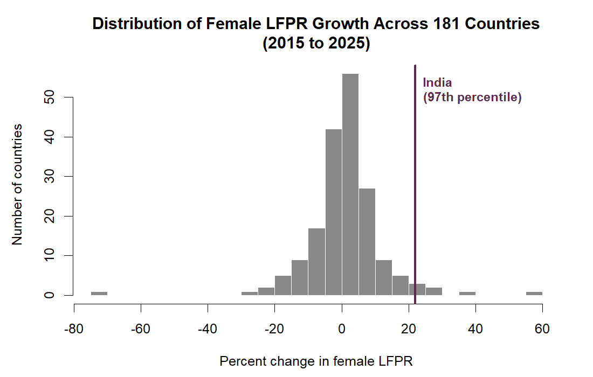
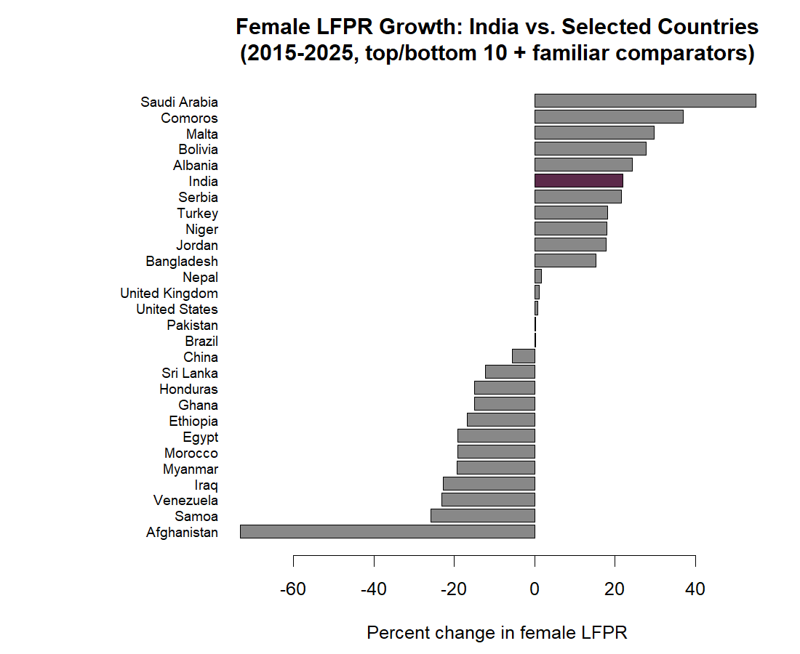
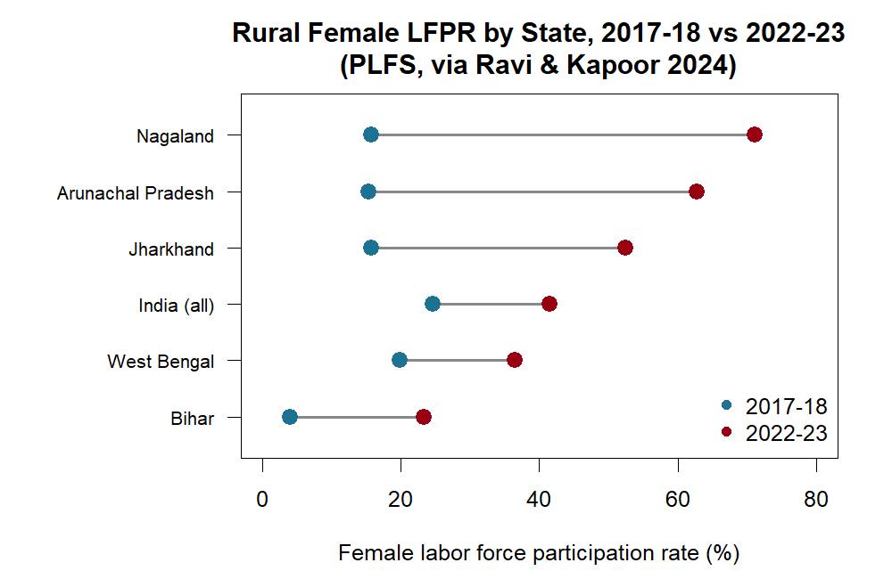
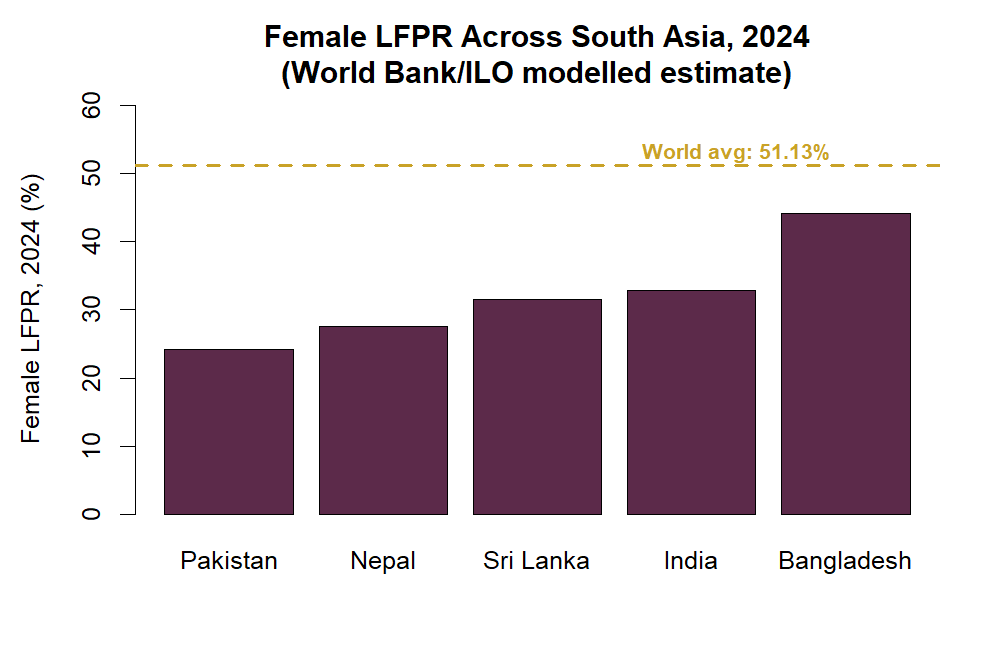
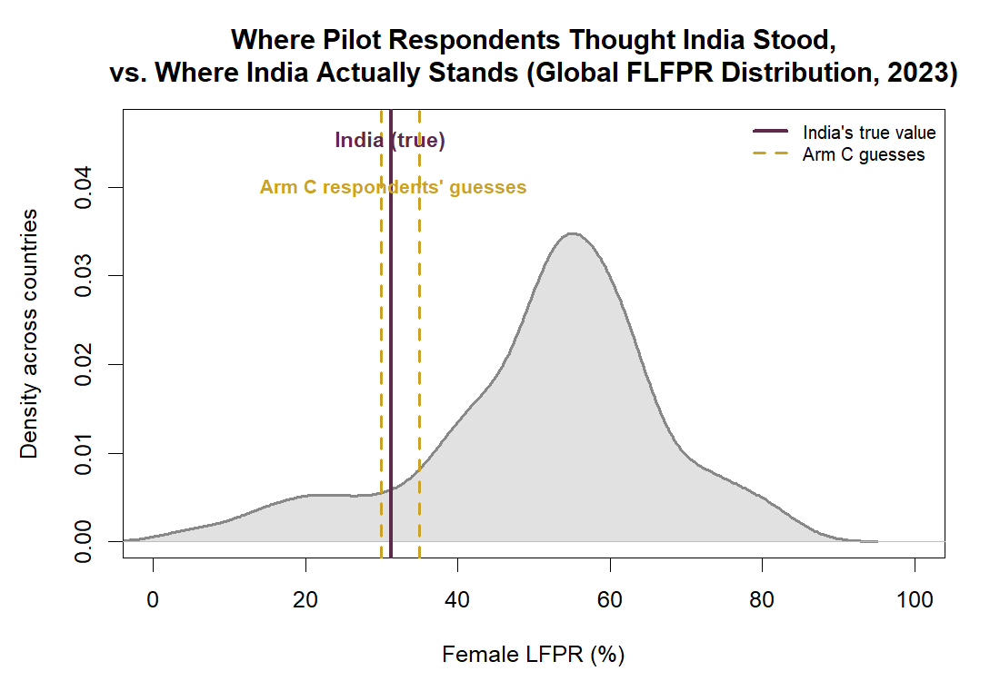

# Misperception and Norms in Female Labor Force Participation: A Pilot Information Experiment

*Joel Nithish Kumar Murugan*

---

## What this study is about

India's female labor force participation rate (FLFPR) has risen sharply in recent years, following a long period of stagnation and decline (Andres et al. 2017; Chatterjee, Murgai, and Rama 2015). Yet there is little evidence on whether this shift is widely recognized outside specialist circles. The gap between a measurable economic change and what people believe about it is the subject of this study.

The study combines two components. First, a small original pilot experiment (N=9) testing whether providing accurate information about India's FLFPR growth shifts respondents' stated support for women's labor force participation, their perceptions of social norms, and their beliefs about whether the trend will continue. Second, a descriptive analysis of a 181-country panel spanning 1990–2025, used to establish what would otherwise be an unsupported premise: that there is something real and unusual to be misperceived in the first place. A claim that people "misperceive" a statistic is only meaningful once that statistic's actual behavior relative to some defensible benchmark has been established. This piece treats that benchmarking exercise as a primary part of the analysis, not as a preliminary aside.

## Research question

Three questions organize the analysis:

1. Is India's recent growth in female labor force participation unusual in cross-country perspective, or does it merely appear large in isolation?
2. Where does India's current *level* of female labor force participation sit relative to the rest of the world a distinct question from its rate of change?
3. When survey respondents are asked to estimate India's FLFPR, how do their estimates compare not only to the "true" figure but to where that figure actually falls in the global distribution? And does correcting respondents' beliefs shift their stated attitudes?

## Data and methods

Four data sources were combined.

**Global panel.** Female labor force participation rates for 1990–2025, sourced from the International Labour Organization's Modelled Estimates series as distributed via the World Bank's World Development Indicators and processed for public distribution by Our World in Data (International Labour Organization 2026; World Bank 2026; Our World in Data 2026).[1](#fn1) The ILO modelled series harmonizes country-reported and statistically imputed values to a common definition (working-age population 15 and above, employed or unemployed) so that cross-country comparison is meaningful (International Labour Organization 2026). After excluding regional and income-group aggregates that are not individual countries "World," "European Union (27)," "High-income countries," and seven similar groupings the panel retains 181 countries with usable data for the comparison window used below.

**India state panel.** State-by-sector female LFPR estimates for 2017-18 and 2022-23, drawn from a working paper's GAM-based analysis of Periodic Labour Force Survey (PLFS) microdata (Ravi and Kapoor 2024). This is a 12-row subset reported in the original paper's text and figures the states the authors highlighted as showing the largest or most policy-relevant change not an independently re-estimated full state panel.

**South Asia comparator.** 2023–2024 FLFPR for India, Bangladesh, Pakistan, Sri Lanka, and Nepal, retrieved individually for each country from the same ILO/World Bank modelled-estimate series used in the global panel (World Bank 2026), ensuring all five countries are measured on one internally consistent scale.

**Pilot survey.** Nine respondents were assigned to one of three arms: a control group; a group shown India's national FLFPR statistic; and a group asked to estimate the statistic before being shown the correct value. This pilot is a feasibility exercise, not a powered study, and its attitudinal results are reported with that caveat throughout.

All computation was carried out in R using only base-R functions `aov()` for analysis of variance, `t.test()` for pairwise comparisons, `cor.test()` for correlation, and base graphics for all figures so the pipeline can be reproduced without installing any package.

---

## Finding 1: India's growth rate is an outlier in cross-country perspective

Over 2015–2025, the longest window with comparable coverage across most countries in the panel, India's female LFPR rose from 26.6% to 32.4%, a 22.0% relative increase. Ranked against the same statistic for 181 other countries over the identical period, this places India at the **97th percentile** of global growth rates: India's rate of increase in female labor force participation exceeds that of roughly 97 of every 100 countries with comparable data.

*Figure 1. Distribution of percent change in female LFPR, 2015–2025, across 181 countries (International Labour Organization 2026; World Bank 2026; Our World in Data 2026). India (vertical line) sits far into the right tail of the distribution.*

Most countries cluster around a modest single-digit percentage change over the decade. India is one of a small number of clear outliers on the high end, in the company of countries such as Saudi Arabia, whose female employment growth over the same period has been the subject of its own active research literature (e.g., Bursztyn, González, and Yanagizawa-Drott 2020, on the role of corrected social-norm beliefs in that specific context).

*Figure 2. India's growth rate (highlighted) against the ten fastest-growing and ten slowest/most-declining countries in the panel, plus a set of widely referenced comparator countries. India sits near the top of the full distribution.*

This is a descriptive, not causal, finding: the analysis establishes that India's recent trajectory is statistically unusual by international standards. It does not identify the mechanism behind that growth, which the underlying PLFS-based literature attributes to a combination of improved measurement of unpaid and subsistence work and genuine behavioral change (Ravi and Kapoor 2024; see also Chatterjee, Murgai, and Rama 2015 on the measurement question specifically).

## Finding 2: India's absolute level remains low in global terms

Growth and level are distinct statistics, and the distinction matters here. On the same panel, India's 2023 FLFPR level sits at only the **11.5th percentile** worldwide roughly 88% of countries in the panel have a higher female labor force participation rate than India, notwithstanding India's unusually rapid recent growth.

This is consistent with a standard "low base" pattern: rapid proportional growth from a low starting point need not close the gap with countries that started from a higher base. The same pattern appears domestically. Figure 3 shows that India's largest state-level gains in the PLFS-based data are concentrated in states Nagaland, Arunachal Pradesh, Jharkhand that began from very low rural female LFPR in 2017-18 (Ravi and Kapoor 2024).

*Figure 3. Rural female LFPR by Indian state, 2017-18 vs. 2022-23, for the states highlighted in Ravi and Kapoor (2024).*

Figure 4 places India in regional context using the same internationally harmonized series. Among its South Asian neighbors, India's 2024 FLFPR (32.8%) sits in the middle of the group: below Bangladesh, comparable to Sri Lanka, above Pakistan and Nepal, and all five countries sit well below the global average of 51.1% (World Bank 2026).

*Figure 4. Female LFPR across South Asia, 2024, World Bank/ILO modelled estimate (World Bank 2026). The dashed line marks the global average.*

## Finding 3: pilot respondents' guesses, benchmarked against the global distribution

The pilot's third arm asked respondents to estimate India's FLFPR before being shown the correct figure. Three respondents' guesses could be compared directly against both the point estimate and the full cross-country distribution for that year.

| Respondent | Guess | True value (World Bank/ILO, 2023) | Guess's own global percentile | True value's global percentile |
|---|---|---|---|---|
| C01 | 30% | 31.24% | 10.4 | 11.5 |
| C02 | 30% | 31.24% | 10.4 | 11.5 |
| C03 | 35% | 31.24% | 13.1 | 11.5 |

The result is not a large misperception. Benchmarked against the World Bank/ILO comparator, respondents' guesses placed India almost exactly where it actually falls in the global distribution. Their apparent intuition that India has comparatively low female labor force participation, though not the lowest in the world is well calibrated against this particular data source.

*Figure 5. Full cross-country distribution of female LFPR, 2023 (shaded), with India's true value (solid line) and the pilot's Arm C guesses (dashed lines) marked.*

This conclusion is sensitive to the choice of benchmark. India's own PLFS national statistic, using a different survey design and a slightly later reference period, reports female LFPR closer to 41–42% (Ministry of Labour and Employment, Government of India 2024). Measured against that figure instead, the same guesses would appear to substantially underestimate the true value. Both statistics are legitimately described as "India's female labor force participation rate"; they differ because they measure different reference populations over different windows using different survey instruments, not because one is in error. This divergence between national administrative statistics and internationally harmonized comparators is a recognized feature of cross-country labor data generally (International Labour Organization 2026) and is treated here as a substantive result rather than a nuisance to be resolved by picking one number. Any claim about the magnitude of a misperception needs to specify which version of "the truth" it is measured against, since that choice alone can move the conclusion from negligible to large.

## Discussion

Taken together, the three findings describe a country climbing quickly (97th percentile on growth) from a low starting point (11th percentile on level), in a way that is broadly consistent with how this small group of respondents intuitively ranked it at least relative to one credible international series. The common intuition that "India still lags substantially in this area" is not, on this evidence, a misperception; it is approximately correct. The more genuine source of potential confusion is not cross-country ranking but the pace of domestic change, and the reconciliation of India's own national statistics with internationally harmonized series that can diverge by ten percentage points or more for reasons of methodology rather than substance.

## Limitations

The pilot experiment's attitudinal component is based on nine respondents across three arms and is not powered to detect anything but very large effects; its results are exploratory and are not reported here as confirmatory. The India state panel is a 12-row subset reported in a single working paper, not an independently constructed full state-year panel (Ravi and Kapoor 2024). The global panel relies on the ILO's modelled estimates, which combine direct survey data with statistical imputation where country-level survey data is unavailable for a given year (International Labour Organization 2026); the percentile calculations in this piece inherit any imprecision in those imputed values. Finally, the percentile-rank exercise is descriptive: it characterizes where India sits in a distribution and does not identify the causes of India's growth trajectory.

## Data sources

1. International Labour Organization. 2026. *ILO Modelled Estimates database (ILOEST)*. ILOSTAT. https://ilostat.ilo.org/data/bulk/
2. World Bank. 2026. *World Development Indicators*, Indicator SL.TLF.CACT.FE.ZS, "Labor force participation rate, female (% of female population ages 15+) (modeled ILO estimate)." https://data.worldbank.org/indicator/SL.TLF.CACT.FE.ZS
3. Our World in Data. 2026. "Female labor force participation rate," data adapted from ILO Modelled Estimates via World Bank, processed by Our World in Data. https://ourworldindata.org/grapher/female-labor-force-participation-rates
4. Ravi, S., and M. Kapoor. 2024. "Female Labour Force Participation Rate: An Observational Analysis of the Periodic Labour Force Survey (PLFS) from 2017-18 to 2022-23." EAC-PM Working Paper Series EAC-PM/WP/34/2024. Economic Advisory Council to the Prime Minister of India. https://eacpm.gov.in/wp-content/uploads/2024/12/EACPM-WP-Female-LFPR-India.pdf
5. Ministry of Labour and Employment, Government of India. 2024. Press release on Periodic Labour Force Survey (PLFS) Annual Report results, Press Information Bureau. https://www.pib.gov.in/PressReleasePage.aspx?PRID=2178389
6. Chatterjee, U., R. Murgai, and M. Rama. 2015. "Job Opportunities along the Rural-Urban Gradation and Female Labor Force Participation in India." World Bank Policy Research Working Paper 7412. https://openknowledge.worldbank.org/bitstreams/d85bbd28-9e27-5569-bf8e-0b66d0dde534/download
7. Andres, L. A., B. Dasgupta, G. Joseph, V. Abraham, and M. Correia. 2017. "Precarious Drop: Reassessing Patterns of Female Labor Force Participation in India." World Bank Policy Research Working Paper 8024. https://documents1.worldbank.org/curated/en/559511491319990632/pdf/WPS8024.pdf
8. Bursztyn, L., A. L. González, and D. Yanagizawa-Drott. 2020. "Misperceived Social Norms: Women Working Outside the Home in Saudi Arabia." *American Economic Review* 110 (10): 2997–3029. https://doi.org/10.1257/aer.20180975

---

1 The data were retrieved as a single CSV download from the Our World in Data grapher page cited above. Full reuse terms (CC BY 4.0) and the exact retrieval date are documented in `data/raw/` alongside the raw file.

## Code and reproducibility

All data cleaning, the percentile-rank calculations, the analysis of variance on pilot outcomes, and all five figures above were produced by a single R script (`R_scripts/01_main_analysis.R`) using only base R, with no external package dependencies. The script, raw data, and output tables are included in this repository.
